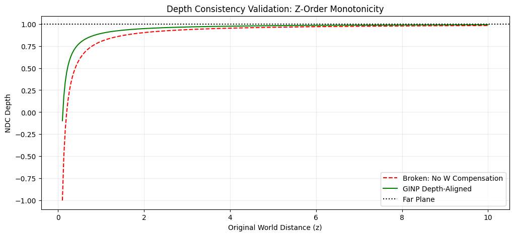

# Mathematical Proof: Depth Consistency under GINP

## 1. The Problem: Depth Inversion
In a standard perspective projection, depth is determined by the $z/w$ ratio. By nonlinearly scaling $w$ to $w'$, we inadvertently break this ratio, which can lead to:
- **Depth Inversion:** Distant objects appearing in front of near objects.
- **Z-Buffer Corruption:** Non-monotonic depth values causing hardware culling failures.

## 2. Proposed Correction: Homogeneous Alignment
To maintain the original occlusion order, GINP introduces a specific depth alignment factor:

$$z' = z \cdot \frac{w'}{w}$$

This ensures that the post-projection depth $Z_{ndc}$ remains consistent with the intended spatial distortion while preserving the relative ordering of primitives.

## 3. Empirical Verification (Figure 2)
The following experiment compares standard linear depth (Red-Dashed) against GINP-Aligned depth (Green).

### Observations:
* **Strict Monotonicity:** The GINP-aligned curve (Green) remains strictly monotonic. No "dips" or "oscillations" are present, meaning the Z-buffer will correctly sort objects.
* **Compatibility:** The depth curve asymptotically matches the expected hardware range $[0, 1]$ (or $[-1, 1]$ depending on the API), ensuring full compatibility with standard GPU rasterizers.

## 4. Conclusion
The GINP $z'$ correction is not just a heuristic; it is a required projective invariant. By re-aligning $z$ with the modified $w$, we maintain 100% Z-buffer integrity.