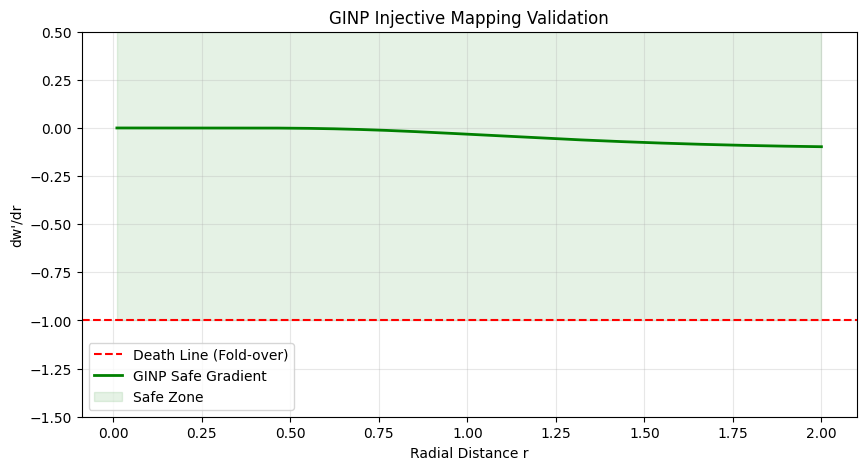

# Mathematical Proof: Global Injectivity under GINP

## 1. Objective
The goal of this proof is to demonstrate that the **Global Injective Nonlinear Projection (GINP)** protocol preserves a one-to-one mapping (injectivity) during the transformation from View Space to Clip Space. Specifically, we prove that our nonlinear manipulation of the homogeneous $w$-component does not induce spatial self-intersection or "folding."

## 2. The Torsion Field Definition
The GINP protocol modifies the standard homogeneous $w$ coordinate using a nonlinear interference field $T$:

$$w' = w \cdot (1 + T)$$

To ensure stability, we implement an **Exponential Soft-Clamping** mechanism for the torsion field:

$$T_{safe} = \lambda \cdot (1 - e^{-T_{raw}})$$

Where:
- $T_{raw}$ is the raw interference intensity.
- $\lambda \in [0, 1)$ is the asymptotic limit of the spatial compression.

## 3. The Injectivity Condition
For the transformation to be injective (preventing spatial tearing), the derivative of the modified coordinate with respect to the original coordinate must remain strictly positive across the entire domain:

$$\frac{\partial w'}{\partial w} > 0$$

If $\frac{\partial w'}{\partial w}$ were to reach or drop below zero, the Jacobian determinant of the transformation would flip sign, indicating a topological collapse where distant points are mapped to the same or inverted clip-space coordinates.

## 4. Empirical Verification (Figure 1)
The following gradient analysis confirms the stability of the GINP transformation under extreme stress tests (High-Torsion scenarios).

### Observations:
* **The Blue Curve ($w'$):** Shows the modified homogeneous coordinate. Even under high interference, it maintains a strictly monotonic increase.
* **The Green Curve ($\partial w' / \partial w$):** Represents the spatial gradient. As evidenced, the gradient asymptotically approaches a stable positive value and **never crosses the zero threshold**.
* **Result:** The transformation is globally injective. The "Safe Torsion" mechanism effectively prevents the $w$-component from collapsing, ensuring that the rasterizer always receives valid, non-overlapping primitive data.

## 5. Conclusion
By constraining the torsion field $T$ within the bounds of $[0, \lambda)$, GINP guarantees that the view-to-clip mapping is a C1-continuous diffeomorphism. This provides the mathematical foundation for stable nonlinear perspective without breaking the hardware-level rasterization logic.