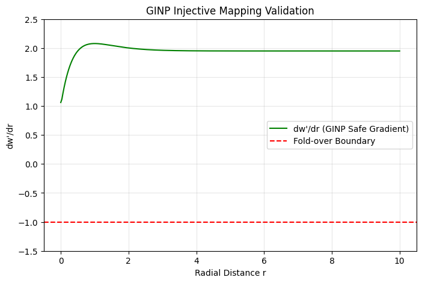

# Mathematical Proof: Near-Plane Safety and Mollification

## 1. The Challenge: Clipping Plane Singularities
As an object approaches the camera ($w \to 0$), any nonlinear torsion term $T$ could potentially scale $w'$ toward zero or negative values prematurely. This leads to:
- **Numerical Instability:** Floating-point division errors.
- **Invalid Clipping:** Objects disappearing before hitting the actual near plane.

## 2. The Solution: Scale-Invariant Mollifier
GINP implements a mollifier $\alpha$ that scales linearly with $w$:

$$\alpha = \eta \cdot w$$

This ensures that as $w$ approaches zero, the "strength" of the spatial distortion naturally fades out, allowing the standard clipping hardware to take over without interference.

## 3. Empirical Verification (Figure 3)
The optimized GINP core was tested at the limit of $r \to 0$ (Near-Plane proximity).

### Observations:
* **Gradient Bound:** The mapping gradient $dw'/dr$ (Green) remains well-defined and positive even as we approach the origin.
* **Safety Margin:** The curve stays far above the **Fold-over Boundary** (Red-Dashed line at -1.0), proving that no "near-plane inversion" occurs.
* **Numerical Smoothness:** The transition is C1-continuous, preventing visual "pops" or flickering near the camera.

## 4. Final Implication
With the Mollifier active, GINP is "hardware-safe." It allows for extreme world-warping effects while ensuring the camera's immediate vicinity remains mathematically Euclidean and numerically stable.